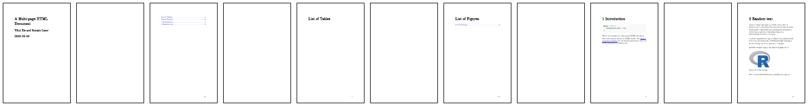
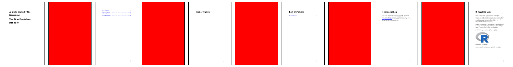
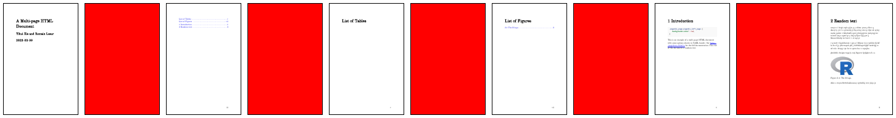

# pagedown-reprex

{pagedown} does not seem to support Paged.js directives in inline CSS chunks.  
It does when the CSS is externally included.

## Reprex

In the examples, I take the boilerplate document for `pagedown::html_paged` (trimmed down).
the left page is made red with the following style:

```css
@page :left {
   background-color: red;
}
```

### Inline CSS ❌

[paged_inline.Rmd](paged_inline.Rmd): a Rmd with CSS in a ````{css}` chunk.

Output:
  


### External CSS ✅

[paged_external.Rmd](paged_external.Rmd): a Rmd with CSS included in the format options.

Output:
  


### Inline CSS, static ✅

[paged_inline_static.Rmd](paged_inline_static.Rmd): a Rmd with CSS in a ````{css}` chunk.
The CSS uses non-Paged.js directives:

```css
.pagedjs_page.pagedjs_left_page {
   background-color: red;
}
```

Output:
  

